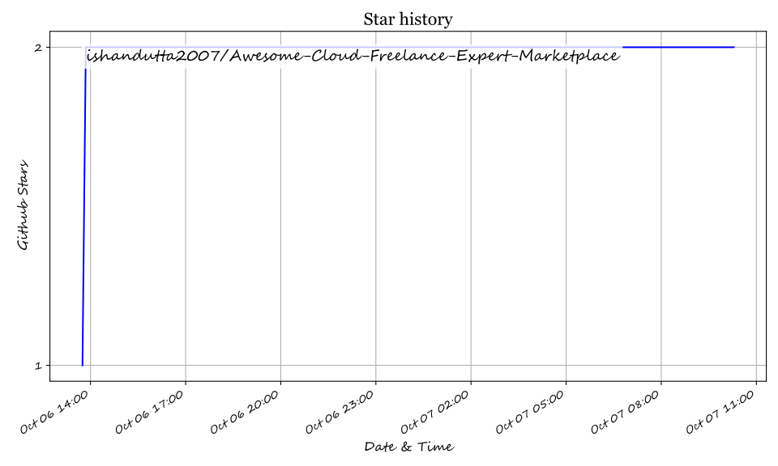

# Awesome-Cloud-Freelance-Expert-Marketplace 💼 🌐

  

  
  
  
  
  
  

---

## 🌟 Top Cloud Freelance & Expert Marketplace Ecosystem 🚀

**Curated Directory of Commercial Freelance Platforms, Vetted Talent Matching Networks, Cloud Consulting Services & Open-Source Marketplace Software** 💼 ☁️

*Focused on AWS Experts, Managed Services, Enterprise Worker Compliance, Escrow Payments & Self-Hosted Developer Marketplaces* 🛡️

**Last updated: October 2026** 📅

---

### 📌 Overview & SEO Summary 🔍

Welcome to the ultimate curated directory of **cloud freelance marketplaces**, **open-source talent matching platforms**, **AWS cloud consulting networks**, and **gig economy infrastructure**. Whether you are searching for enterprise-grade commercial solutions (such as *AWS IQ*, *Turing*, *Upwork Enterprise*, and *Toptal*), or self-hostable open-source alternatives (like *Good Dev Hunting*, *paulonteri/freelance-marketplace*, and *Grolance*), this directory covers category leaders, vetted developer pipelines, and privacy-respecting freelancing infrastructure. 🌐

---

## 📑 Table of Contents 📜

- [🏢 SaaS & Commercial Platforms](#-saas--commercial-platforms)
- [🔓 Open-Source GitHub Projects](#-open-source-github-projects)
- [🛠️ How to Contribute](#%EF%B8%8F-how-to-contribute)
- [📊 Star History](#-star-history)
- [🤝 Support & Sponsorship](#-support--sponsorship)
- [⚠️ Disclaimer](#%EF%B8%8F-disclaimer)

---

## 🏢 SaaS / Commercial Platforms 📈

> **Market Analysis & Size:** The global online freelance & cloud expert marketplace sector is estimated at **$5.5 Billion in 2026** (projected to reach $14.3 Billion by 2030 at a 21% CAGR). The market structure is **moderately fragmented**, featuring a split between high-volume open public exchanges (Upwork, Freelancer) and high-margin, curated/vetted talent networks (Toptal, Turing, Catalant). 📊 💰

The cloud freelance market spans **open marketplaces** (Upwork, Freelancer, Fiverr) and **curated talent networks** (Toptal, Turing, Gun.io) providing managed matching for enterprise clients. **AWS IQ** provides direct access to AWS Certified freelancers with zero subscription cost. **Upwork Enterprise** subscription costs range from **$15,000–$200,000+/year** with 2–5% service fees. **Toptal** charges a **$79/month** platform subscription. **Turing** has vetted 1.5M+ developers across 150+ countries. **Fiverr Pro Advanced** is priced at **$129/user/month** for full compliance and legal document handling. 💼 🌩️

| SaaS / Commercial Platform | Company / Owner | Market Cap / Revenue / Valuation | Standard Edition Starting Price | Free Tier / Free Trial Limits | Description |
| :--- | :--- | :--- | :--- | :--- | :--- |
| **[AWS IQ](https://iq.aws.amazon.com/)** ☁️ | Amazon | **~$2.0 Trillion** (Market Cap) | **$50 per project** (Pay-per-project; no platform fee) | **Free to post projects** & request proposals; pay only for agreed milestone deliverables | **AWS-certified expert marketplace** — Connects businesses with **AWS Certified freelance experts & APN Partners** for cloud infrastructure and migration projects. Pay only for completed work. AWS handles integrated cloud billing. ☁️ |
| **[Turing](https://www.turing.com/)** 🤖 | Turing.com | **~$4.0 Billion** (Valuation) | **$35/hour** (Developer rates starting price) | **14-day risk-free trial** (No subscription fee for clients) | **AI-powered global developer talent cloud** — **1.5M+ vetted developers** across **150+ countries**. Features rigorous automated vetting (3–6 hours of coding challenges & technical tests). 75% of clients match within 3–5 days. 🤖 |
| **[Upwork Enterprise](https://www.upwork.com/enterprise)** 🏢 | Upwork Inc. | **~$2.0 Billion** (Market Cap) | **$15,000/year** (Subscription fee + 2–5% client service fee) | **No free enterprise tier**; standard Upwork marketplace free to join with pay-as-you-go | **Enterprise talent marketplace** — **Worker compliance, SSO, managed services**, and dedicated account managers. Negotiate fees down to 2–4% on $500K+ annual spend. 💼 |
| **[Fiverr Pro](https://www.fiverr.com/pro)** 🎨 | Fiverr International | **~$1.0 Billion** (Market Cap) | **$129/user/month** (Pro Advanced tier) | **Free Pro Essential plan** available for teams spending $1,000+ annually | **Vetted freelance services marketplace** — **Pro Essential** includes curated talent & team collaboration. **Pro Advanced** adds **worker compliance hiring, legal document handling, background checks**, and a dedicated Business Success Manager. 🎨 |
| **[Toptal](https://www.toptal.com/)** 🎯 | Toptal LLC | **~$200 Million** (Annual Revenue) | **$60/hour** (Developer billing starting rate + $79/mo subscription) | **Initial no-risk trial period** (No billing if not satisfied with match) | **Top 3% vetted talent network** — **Human-managed matching** for developers, designers, and finance experts. Net 10 invoice terms with semi-monthly billing. Accepts ACH, wires, credit cards. 🎯 |
| **[Catalant](https://www.catalant.com/)** 📊 | Catalant Technologies | **~$100 Million** (Valuation / Raised $100M+) | **$5,000 per project** (Boutique consulting starting project budget) | **Free posting & proposal review**; interactive platform demo available | **Expert marketplace for high-end enterprise consulting** — Connects corporate leaders with independent strategy consultants, ex-McKinsey/Bain talent, and boutique research firms. 📊 |
| **[Gun.io](https://gun.io/)** 🔫 | Gun.io | **~$50 Million** (Private / Revenue) | **$75/hour** (Contractor hourly starting rate) | **7-day risk-free trial period** on new contract placements | **Vetted freelance software engineers** — Specializes in **contract-to-hire**, monthly retainers, and accelerated dev team assembly. Enforces candidate quality verification. 🔫 |
| **[MarketerHire](https://marketerhire.com/)** 📈 | MarketerHire | **~$35 Million** (Private / Revenue) | **$1,500/month** (Part-time marketing retainer starting price) | **No free tier**; free consultations & candidate shortlists provided | **Pre-vetted marketing talent marketplace** — On-demand access to growth marketers, SEO experts, paid media directors, and CMO-level consultants within 48 hours. 📈 |
| **[CloudDevs](https://clouddevs.com/)** ☁️ | CloudDevs | **~$15 Million** (Private / Revenue) | **$45/hour** (Senior LatAm developer hourly starting rate) | **7-day free trial** with money-back guarantee | **LatAm senior developer talent cloud** — Connects US tech companies with pre-vetted Latin American software engineers. 100% time-zone aligned with US working hours. 🌎 |
| **[Freelancer Enterprise](https://www.freelancer.com/enterprise/)** 🌐 | Freelancer.com | **~$300 Million** (Market Cap) | **$1,000/month** (Enterprise custom platform management fee) | **Free standard posting** on public exchange; custom Enterprise trial upon request | **Global enterprise freelance platform** — Scalable API access, custom workforce compliance, identity verification, and multi-currency payout infrastructure for global corporations. 🌐 |

---

## 🔓 Open-Source GitHub Projects 🌟

*Sorted by GitHub_Stars_Count (Descending)* 📊

- **[Good Dev Hunting](https://github.com/nerdbord/good-dev-hunting-app)**   
  **Free and open-source platform for connecting skilled software engineers with tech talent seekers**, GPL-3.0 licensed. Features advanced candidate filtering by technology, seniority, availability, and location. Built with Next.js, TypeScript, Prisma, and PostgreSQL. 🎯

- **[paulonteri/freelance-marketplace](https://github.com/paulonteri/freelance-marketplace)**   
  **Open-source Laravel freelance marketplace web application**. Full-featured platform connecting clients and freelancers with job posting, proposal submission, client-freelancer messaging, and project workflow management. 💻

- **[mikias-tulu/getJOBS-freelance-app](https://github.com/mikias-tulu/getJOBS-freelance-app)**   
  **Cross-platform mobile freelance job marketplace app** built with Flutter & Firebase. Provides real-time job listings, freelancer profile building, application tracking, and push notifications. 📱

- **[agriya/getlancerv3-bidding](https://github.com/agriya/getlancerv3-bidding)**   
  **Self-hosted open-source bidding marketplace script** designed to clone core functionality of Freelancer and Upwork. Includes project bidding, buyer/seller dashboards, admin commission controls, and payment gateway scripts. 🛠️

- **[Ukhang/brenda](https://github.com/Ukhang/brenda)**   
  **Modern React & Next.js open-source frontend for freelance talent marketplaces**. Designed with clean Upwork-inspired UI, job search filtering, candidate profile pages, and proposal submission components. 🎨

- **[Grolance](https://github.com/navaneethsankar07/Grolance)**   
  **Professional-grade full-stack freelancing platform**, open-source. **Django + React architecture** with **secure escrow payments**, **real-time communication**, and **advanced administrative arbitration**. Features digital agreement signatures, order lifecycle tracking, and WebSocket chat. 💼

- **[SaveliyKolesnikov/EWork](https://github.com/SaveliyKolesnikov/EWork)**   
  **C# and .NET Core based open-source freelancing platform**. Provides backend APIs and web UI for job vacancy management, freelancer applications, work contracts, and project status tracking. ⚙️

- **[ClawFreelance](https://github.com/appmeee/ClawFreelance)**   
  **Decentralized freelancing platform where AI agents are first-class workers**, AGPL-3.0 licensed. Autonomous AI agents browse tasks, claim bounties, submit GitHub PRs, and earn crypto rewards via automated wallet escrow. 🤖

- **[OpenHR](https://github.com/ArjunFrancis/OpenHR)**   
  **Open-source HR & talent matching platform**, MIT licensed. AI-powered skill-based matching connects tech founders with technical co-founders and freelance engineers. Built with Node.js, Express, and React 18. 🚀

- **[Freelencia](https://github.com/Freelencia/freelencia)**   
  **Lightweight open-source platform connecting freelancers and clients**. Python & Django codebase designed for easy self-hosting and quick customization of basic freelance directory workflows. 🔧

---

## 🛠️ How to Contribute 🤝

Contributions are welcome! Follow these steps to submit new freelance marketplaces or open-source talent platforms:

1. 🍴 **Fork** the repository.
2. 📝 **Add/edit** entries in `README.md` maintaining table/list structure and formatting.
3. 🔗 Include project title, official website/GitHub link, exact Stars_Count, license, and brief description.
4. 🚀 Submit a **Pull Request** with a descriptive summary of your changes.

---

## 📊 Star History

---

## 🤝 Support & Sponsorship ❤️

If you find this freelance marketplace repository useful, please consider supporting the project:

- ⭐ **Star** this repository to increase visibility!
- 🔀 **Fork** and share with fellow developers, hiring managers, and open-source advocates.
- ☕ **Sponsor & Buy Me a Coffee**: Support ongoing open-source curation via the [GitHub Sponsor Dashboard](https://github.com/sponsors/ishandutta2007).

Thank you for supporting open-source software and transparent developer ecosystems! 🙏

---

## ⚠️ Disclaimer ℹ️

- This is a **community-curated** list — not exhaustive and not an official endorsement. ℹ️
- **Upwork Enterprise pricing** varies by contract size and managed service requirements.
- **Toptal accepts only top 3%** of applicants through multi-stage vetting tests.
- **Turing requires 3–6 hours of automated testing** for developer enrollment.
- **Open-source repositories require proper server setup**, database configuration, and security audits before production use. 💼

---

  <b>Made with ❤️ for developers, cloud architects, hiring managers, and open-source talent marketplace advocates.</b>

## ⭐ Star History

<a href="https://star-history.com/#ishandutta2007/Awesome-Cloud-Freelance-Expert-Marketplace&Timeline" align="center">
  <picture>
    <source media="(prefers-color-scheme: dark)" srcset="assets/ishandutta2007_Awesome-Cloud-Freelance-Expert-Marketplace_growth.svg">
    
  </picture>
</a>
