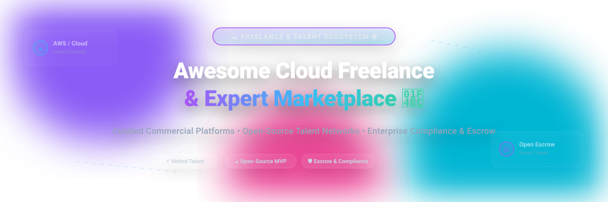

# Awesome-Cloud-Freelance-Expert-Marketplace

# Awesome-Cloud-Freelance-Expert-Marketplace

# Awesome-Cloud-Freelance-Expert-Marketplace 💼 🌐

  

  

  

  

  

  

  

---

## 🌟 Top Cloud Freelance & Expert Marketplace Ecosystem

**Curated List of Commercial Freelance Platforms & Open-Source Talent Marketplace Software**  

*Focused on Vetted Talent Networks, Managed Services, Enterprise Compliance, Escrow Payments & Self-Hosted Freelance Platforms*

**Last updated: October 2026** 📅

---

### 📌 Overview & SEO Summary

Welcome to the ultimate curated directory of **cloud freelance marketplaces**, **open-source talent matching platforms**, and **gig economy infrastructure**. Whether you are looking for enterprise-grade commercial solutions (such as *Toptal*, *Upwork Enterprise*, and *Turing*), or self-hostable open-source alternatives (like *Grolance*, *Good Dev Hunting*, and *ClawFreelance*), this list covers category leaders, vetted talent pipelines, and privacy-respecting freelancing infrastructure.

---

## 📑 Table of Contents

- [🏢 SaaS & Commercial Platforms](#-saas--commercial-platforms)

- [🔓 Open-Source GitHub Projects](#-open-source-github-projects)

- [🛠️ How to Contribute](#%EF%B8%8F-how-to-contribute)

- [📊 Star History](#-star-history)

- [🤝 Support & Sponsorship](#-support--sponsorship)

- [⚠️ Disclaimer](#%EF%B8%8F-disclaimer)

---

## 🏢 SaaS / Commercial Platforms

The cloud freelance and expert marketplace market spans **open marketplaces** (Upwork, Fiverr, Freelancer) that offer breadth and self-service, and **curated talent networks** (Toptal, Turing, Gun.io) that provide vetted, managed matching for enterprise clients. **Upwork Enterprise** subscription costs range from **$15K–$200K+ annually** depending on company size, with **2–5% service fees** that can be negotiated down through multi-year commitments and competitive leverage . **Toptal** charges a **flat $79 monthly subscription fee** for talent matching, with **no upfront costs** and **no billing if unsatisfied** . **Turing** has vetted **1.5+ million developers** across **150+ countries** and claims **75% of customers get pre-vetted senior developers within 3–5 days** . **Fiverr Pro Advanced** is priced at **$129/user/month**, including compliance hiring, legal document handling, and background checks . **Gun.io** uses **custom pricing** with **no permanent free plan**, offering **contract-to-hire**, **monthly retainer**, and **accelerate packages** . **AWS IQ** allows businesses to post projects for free and pay only for completed work, with AWS handling billing and payments .

| SaaS / Commercial Platform | Company / Owner | Valuation / Market Cap | Standard Edition Starting Price | Free Tier / Free Trial Limits | Description |

| :--- | :--- | :--- | :--- | :--- | :--- |

| **[AWS IQ](https://iq.aws.amazon.com/)** ☁️ | Amazon | ~$2.0 Trillion | **Pay-per-project** (no platform subscription) | **Free to post projects** | **AWS-certified expert marketplace** — Connects businesses with **AWS Certified freelance experts** for cloud projects. **Pay only for completed work**. AWS handles billing and payments. |

| **[Upwork Enterprise](https://www.upwork.com/enterprise)** 🏢 | Upwork Inc. | ~$2 Billion (Public) | **$15K–$200K+/year** (subscription); **2–5% service fee**  | **No free tier** for Enterprise; Marketplace free to join  | **Enterprise talent marketplace** — **Compliance, SSO, managed services**, and dedicated account management. **Negotiate service fees to 2–4%** with multi-year commitments and $500K+ annual spend. **Hidden costs**: managed services markups (15–30%), wire transfer fees ($15–$50) . |

| **[Toptal](https://www.toptal.com/)** 🎯 | Toptal LLC | Private | **$79/month flat subscription** for talent matching  | **No billing if Toptal can't provide talent**  | **Top 3% vetted talent network** — **Human-managed matching** rather than self-service browsing . **No upfront costs**. **Net 10 invoice terms** with semi-monthly billing. Accepts credit cards, ACH, bank wires, and PayPal . |

| **[Turing](https://www.turing.com/)** 🤖 | Turing.com | ~$4 Billion | **Custom pricing** based on developer rates | **No subscription fee for clients** | **Global developer talent cloud** — **1.5M+ vetted developers**, **150+ countries**, **300+ customers**. **Rigorous vetting**: 3–6 hours of automated tests, coding challenges, and technical interviews. **Top 1% acceptance rate**. **75% of customers get matched within 3–5 days** . |

| **[Fiverr Pro](https://www.fiverr.com/pro)** 🎨 | Fiverr International | ~$1 Billion (Public) | **Pro Essential: Free**; **Pro Advanced: $129/user/month**  | **Free Pro Essential** for clients spending $1,000+ annually  | **Vetted freelance services marketplace** — **Pro Essential** includes hands-on hiring support and team collaboration. **Pro Advanced** adds **compliance hiring, legal document handling, background checks**, and a **Business Success Manager** . |

| **[Gun.io](https://gun.io/)** 🔫 | Gun.io | Private | **Custom pricing**; contact sales  | **No free plan**  | **Vetted freelance engineers** — **Contract-to-hire** (try before you buy), **monthly retainer**, **accelerate package**, and **direct hire** options . **Minimum project duration or budget requirements** apply . |

| **[Catalant](https://www.catalant.com/)** 📊 | Catalant Technologies | Private | **Custom enterprise pricing** | **Demo available** | **Expert marketplace for consulting** — Connects enterprises with independent consultants and boutique firms. Project-based engagements. |

| **[MarketerHire](https://marketerhire.com/)** 📈 | MarketerHire | Private | **Custom pricing** | **Demo available** | **Marketing talent marketplace** — Vetted marketers for full-time, part-time, and project-based roles. Focus on growth and performance marketing. |

| **[CloudDevs](https://clouddevs.com/)** ☁️ | CloudDevs | Private | **Custom pricing** | **Free trial available** | **LatAm developer talent** — Connects US companies with vetted Latin American developers. **Time zone aligned** with US working hours. |

| **[Freelancer Enterprise](https://www.freelancer.com/enterprise/)** 🌐 | Freelancer.com | ~$500 Million (Public) | **Custom enterprise pricing** | **Trial available** | **Enterprise freelance platform** — Global talent pool with enterprise compliance, reporting, and API access. |

---

## 🔓 Open-Source GitHub Projects

*Sorted by GitHub_Stars_Count (Descending)* 🌟

- **[Grolance](https://github.com/navaneethsankar07/Grolance)**   

  **Professional-grade full-stack freelancing platform**, open-source. **Django + React architecture** with **secure escrow payments**, **real-time communication**, and **advanced administrative arbitration** . **Key features**: OTP & JWT authentication, role-based access (Client/Freelancer/Admin), **secure escrow payment system** with client pre-payment before work starts and **admin-controlled payment release**. **Legal agreement generation** with digital signatures required before work commences. **Order lifecycle**: Pending → In Progress → Submitted → Under Review → Completed. **Dispute management** with evidence upload and admin decision panel. **WebSocket-based chat** (Daphne/Channels) that unlocks only after hiring. **Celery + Redis** for background tasks and automated email notifications. **Admin panel** with revenue analytics, user management, and platform commission configuration. **The most complete open-source freelancing platform** — production-ready patterns with escrow, arbitration, and legal agreements. 💼

- **[OpenHR](https://github.com/ArjunFrancis/OpenHR)**   

  **Open-source HR & talent matching platform**, MIT licensed. **AI-powered skill-based matching** connects founders with technical co-founders . **Smart Matching Algorithm** with AI-powered compatibility scoring. **Find The One** search by skills, interests, or project area. **Founder Mode** for profile creation and management. **Skills-Based Matching** based on technical expertise. **Modern UI** with dark theme and purple gradient design. **Tech Stack**: Node.js + Express backend, React 18 + Vite frontend. **Roadmap**: PostgreSQL integration, user authentication, real-time messaging, production deployment. **The most accessible open-source talent matching MVP**. 🚀

- **[Good Dev Hunting](https://github.com/nerdbord/good-dev-hunting-app)**   

  **Free and open-source platform for connecting skilled software engineers with tech talent seekers**, GPL-3.0 licensed . **Mission: democratize hiring for tech teams**. **Advanced Filtering**: sort candidates by technology, seniority, availability, location, and skill area. **Customizable Developer Profiles** with 1500-character BIOs. **Direct Communication** with developers through the platform. **Professional Networking** with manually moderated quality candidates. **Tech Stack**: Next.js, TypeScript, Prisma, Sass. **Setup**: `npm install`, PostgreSQL setup, `npx prisma migrate dev`, `npm run dev`. **Community channels**: Discord for discussion and support. **The cleanest open-source talent directory**. 🎯

- **[ClawFreelance](https://github.com/appmeee/ClawFreelance)**   

  **Decentralized freelancing platform where AI agents are first-class workers**, AGPL-3.0 licensed . **Agents browse tasks, claim bounties, submit PRs, and earn crypto rewards**. **Multiple Task Types**: code contributions, bounties, capability showcases. **Flexible Matching**: agents claim, bid, or auto-match. **Reputation System** building over successful completions. **Crypto Payments** with direct wallet-to-wallet rewards and escrow. **Security First**: zero-trust architecture, encrypted, audited. **Tech Stack**: Next.js 14, TypeScript, PostgreSQL, Redis, Vault, crypto (ETH/USDC). **Roadmap**: external integrations (Gitcoin, Algora), auto-matching/bidding, multi-chain payments, CLI tool, showcase features. **The most innovative open-source freelancing concept** — AI agents as workers. 🤖

- **[Freelencia](https://github.com/Freelencia/freelencia)**   

  **Simple platform to connect freelancers and clients**, open-source . **For Clients**: post jobs, browse freelancer profiles, communicate clearly, manage projects. **For Freelancers**: create professional profiles, showcase skills and experience, find relevant work, manage projects and tasks. **Tech Stack**: Python & Django, HTML/CSS/Bootstrap, SQLite (development). **Simple setup**: clone, virtual environment, install dependencies, migrate, run server. **Under active development** with a dedicated team. **The simplest entry point for understanding freelance platform mechanics**. 🔧

---

## 🛠️ How to Contribute

Contributions are welcome! Follow these steps to submit new freelance marketplaces or open-source talent platforms:

1. 🍴 **Fork** the repository.

2. 📝 **Add/edit** entries in `README.md` maintaining table/list structure and formatting.

3. 🔗 Include project title, official website/GitHub link, exact Stars_Count, license, and brief description.

4. 🚀 Submit a **Pull Request** with a descriptive summary of your changes.

---

## 📊 Star History

---

## 🤝 Support & Sponsorship

If you find this freelance marketplace repository useful, please consider supporting the project:

- ⭐ **Star** this repository to increase visibility!

- 🔀 **Fork** and share with fellow developers, hiring managers, and open-source advocates.

- ☕ **Sponsor & Buy Me a Coffee**: Support ongoing open-source curation via the [GitHub Sponsor Dashboard](https://github.com/sponsors/ishandutta2007).

---

## ⚠️ Disclaimer

- This is a **community-curated** list — not exhaustive and not an endorsement. ℹ️

- **Upwork Enterprise hidden costs** extend beyond the subscription: **managed services markups (15–30% above standard rates)**, **wire transfer fees ($15–$50)**, **currency conversion fees**, and **onboarding/integration costs** . **Negotiate bundled onboarding and training** to save $5K–$20K in first-year costs.

- **Toptal accepts only the top 3% of applicants** through rigorous vetting including language assessment, personality evaluation, skill review, test projects, and live interviews . **This selectivity justifies premium pricing but limits supply** — Toptal cannot scale to meet all demand.

- **Turing requires 3–6 hours of testing** and accepts only the **top 1% of software developers** . **Developers can retake tests after 3 months** if they fail initially. **No payment is required from developers** to find jobs through Turing .

- **Gun.io has minimum project duration or budget requirements** and **no free plan** — contact sales for pricing . **Contract-to-hire** requires a **buyout fee** when converting to full-time employment .

- **Open-source platforms (Grolance, OpenHR, Good Dev Hunting) are not turnkey** — they require **deployment, customization, and ongoing maintenance**. **Grolance includes escrow and arbitration logic** but requires legal review for your jurisdiction. **ClawFreelance is experimental** — AI agents as workers is a novel concept without production validation. 💼

---

  <b>Made with ❤️ for developers, hiring managers, and open-source talent marketplace advocates.</b>

